# [📈 Live Status](https://uptime.cloudbip.com): <!--live status--> **🟧 Partial outage**

This repository contains the open-source uptime monitor and status page for [Upptime](https://upptime.js.org), powered by [Upptime](https://github.com/upptime/upptime).

With [Upptime](https://upptime.js.org), you can get your own unlimited and free uptime monitor and status page, powered entirely by a GitHub repository. We use [Issues](https://github.com/upptime/upptime/issues) as incident reports, [Actions](https://github.com/cloudbip/upptime/actions) as uptime monitors, and [Pages](https://uptime.cloudbip.com) for the status page.

<!--start: status pages-->
<!-- This summary is generated by Upptime (https://github.com/upptime/upptime) -->
<!-- Do not edit this manually, your changes will be overwritten -->
<!-- prettier-ignore -->
| URL | Status | History | Response Time | Uptime |
| --- | ------ | ------- | ------------- | ------ |
|  [000webhost.com](https://www.000webhost.com) | 🟥 Down | [000webhost-com.yml](https://github.com/cloudbip/upptime/commits/HEAD/history/000webhost-com.yml) | 

 101ms
     
 | 

<a href="https://uptime.cloudbip.com/history/000webhost-com">0.00%</a>
    

|  [ach.id](https://ach.id) | 🟩 Up | [ach-id.yml](https://github.com/cloudbip/upptime/commits/HEAD/history/ach-id.yml) | 

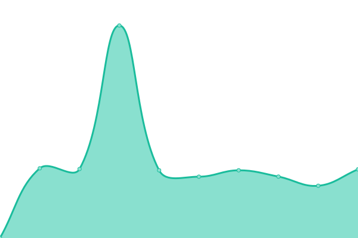 3411ms
     
 | 

<a href="https://uptime.cloudbip.com/history/ach-id">0.00%</a>
    

|  [ardhosting.com](https://ardhosting.com) | 🟩 Up | [ardhosting-com.yml](https://github.com/cloudbip/upptime/commits/HEAD/history/ardhosting-com.yml) | 

 2118ms
     
 | 

<a href="https://uptime.cloudbip.com/history/ardhosting-com">100.00%</a>
    

|  [argonhost.com](https://argonhost.com) | 🟩 Up | [argonhost-com.yml](https://github.com/cloudbip/upptime/commits/HEAD/history/argonhost-com.yml) | 

 6416ms
     
 | 

<a href="https://uptime.cloudbip.com/history/argonhost-com">99.58%</a>
    

|  [Beon.co.id](https://beon.co.id) | 🟩 Up | [beon-co-id.yml](https://github.com/cloudbip/upptime/commits/HEAD/history/beon-co-id.yml) | 

 3283ms
     
 | 

<a href="https://uptime.cloudbip.com/history/beon-co-id">0.00%</a>
    

|  [biznetgio.com](https://biznetgio.com) | 🟩 Up | [biznetgio-com.yml](https://github.com/cloudbip/upptime/commits/HEAD/history/biznetgio-com.yml) | 

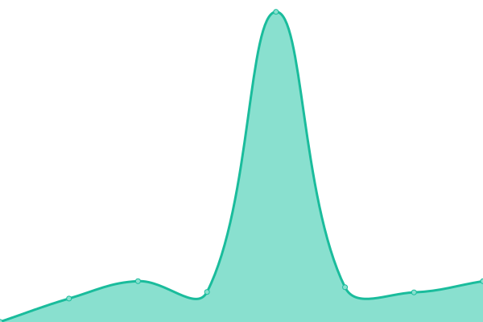 2627ms
     
 | 

<a href="https://uptime.cloudbip.com/history/biznetgio-com">100.00%</a>
    

|  [boc.co.id](https://boc.co.id) | 🟩 Up | [boc-co-id.yml](https://github.com/cloudbip/upptime/commits/HEAD/history/boc-co-id.yml) | 

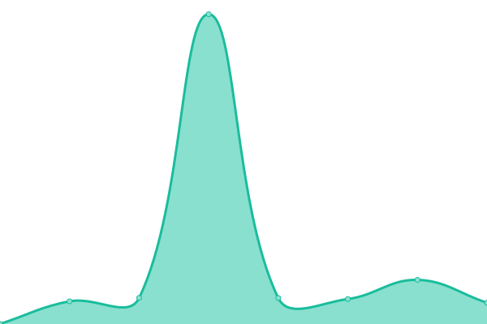 1031ms
     
 | 

<a href="https://uptime.cloudbip.com/history/boc-co-id">100.00%</a>
    

|  [Byakta.com](https://byakta.com) | 🟩 Up | [byakta-com.yml](https://github.com/cloudbip/upptime/commits/HEAD/history/byakta-com.yml) | 

 801ms
     
 | 

<a href="https://uptime.cloudbip.com/history/byakta-com">0.00%</a>
    

|  [cloudraya.com](https://cloudraya.com) | 🟩 Up | [cloudraya-com.yml](https://github.com/cloudbip/upptime/commits/HEAD/history/cloudraya-com.yml) | 

 7994ms
     
 | 

<a href="https://uptime.cloudbip.com/history/cloudraya-com">100.00%</a>
    

|  [cp.cloudraya.com](https://cp.cloudraya.com) | 🟩 Up | [cp-cloudraya-com.yml](https://github.com/cloudbip/upptime/commits/HEAD/history/cp-cloudraya-com.yml) | 

 1220ms
     
 | 

<a href="https://uptime.cloudbip.com/history/cp-cloudraya-com">0.00%</a>
    

|  [citrahost.com](https://citrahost.com) | 🟩 Up | [citrahost-com.yml](https://github.com/cloudbip/upptime/commits/HEAD/history/citrahost-com.yml) | 

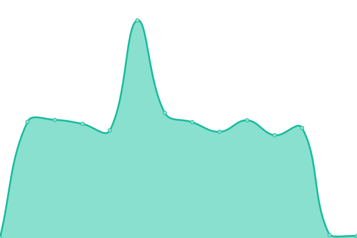 2130ms
     
 | 

<a href="https://uptime.cloudbip.com/history/citrahost-com">100.00%</a>
    

|  [rumahweb.com](https://rumahweb.com) | 🟩 Up | [rumahweb-com.yml](https://github.com/cloudbip/upptime/commits/HEAD/history/rumahweb-com.yml) | 

 2461ms
     
 | 

<a href="https://uptime.cloudbip.com/history/rumahweb-com">100.00%</a>
    

|  [clientzon.rumahweb.com](https://clientzone.rumahweb.com) | 🟩 Up | [clientzon-rumahweb-com.yml](https://github.com/cloudbip/upptime/commits/HEAD/history/clientzon-rumahweb-com.yml) | 

 1238ms
     
 | 

<a href="https://uptime.cloudbip.com/history/clientzon-rumahweb-com">100.00%</a>
    

|  [cLoudbip.com](https://cloudbip.com) | 🟥 Down | [c-loudbip-com.yml](https://github.com/cloudbip/upptime/commits/HEAD/history/c-loudbip-com.yml) | 

 0ms
     
 | 

<a href="https://uptime.cloudbip.com/history/c-loudbip-com">0.00%</a>
    

|  [dihostingin.com](https://dihostingin.com) | 🟩 Up | [dihostingin-com.yml](https://github.com/cloudbip/upptime/commits/HEAD/history/dihostingin-com.yml) | 

 2695ms
     
 | 

<a href="https://uptime.cloudbip.com/history/dihostingin-com">100.00%</a>
    

|  [member.dihostingin.com](https://member.dihostingin.com) | 🟩 Up | [member-dihostingin-com.yml](https://github.com/cloudbip/upptime/commits/HEAD/history/member-dihostingin-com.yml) | 

 1633ms
     
 | 

<a href="https://uptime.cloudbip.com/history/member-dihostingin-com">100.00%</a>
    

|  [dewabiz.com](https://dewabiz.com) | 🟩 Up | [dewabiz-com.yml](https://github.com/cloudbip/upptime/commits/HEAD/history/dewabiz-com.yml) | 

 1985ms
     
 | 

<a href="https://uptime.cloudbip.com/history/dewabiz-com">100.00%</a>
    

|  [my.dewabiz.com](https://my.dewabiz.com) | 🟩 Up | [my-dewabiz-com.yml](https://github.com/cloudbip/upptime/commits/HEAD/history/my-dewabiz-com.yml) | 

 4638ms
     
 | 

<a href="https://uptime.cloudbip.com/history/my-dewabiz-com">98.99%</a>
    

|  [portal.cloudkilat.com](https://portal.cloudkilat.com) | 🟩 Up | [portal-cloudkilat-com.yml](https://github.com/cloudbip/upptime/commits/HEAD/history/portal-cloudkilat-com.yml) | 

 4236ms
     
 | 

<a href="https://uptime.cloudbip.com/history/portal-cloudkilat-com">99.78%</a>
    

|  [idcloudhost.com](https://idcloudhost.com) | 🟩 Up | [idcloudhost-com.yml](https://github.com/cloudbip/upptime/commits/HEAD/history/idcloudhost-com.yml) | 

 284ms
     
 | 

<a href="https://uptime.cloudbip.com/history/idcloudhost-com">100.00%</a>
    

|  [console.idcloudhost.com](https://console.idcloudhost.com) | 🟩 Up | [console-idcloudhost-com.yml](https://github.com/cloudbip/upptime/commits/HEAD/history/console-idcloudhost-com.yml) | 

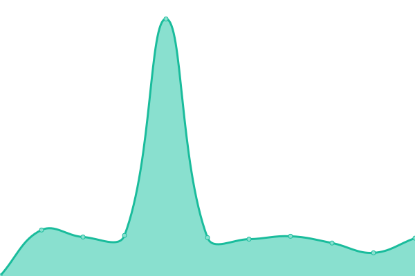 1954ms
     
 | 

<a href="https://uptime.cloudbip.com/history/console-idcloudhost-com">100.00%</a>
    

|  [my.idcloudhost.com](https://my.idcloudhost.com) | 🟩 Up | [my-idcloudhost-com.yml](https://github.com/cloudbip/upptime/commits/HEAD/history/my-idcloudhost-com.yml) | 

 6436ms
     
 | 

<a href="https://uptime.cloudbip.com/history/my-idcloudhost-com">99.75%</a>
    

|  [dewaweb.com](https://dewaweb.com) | 🟩 Up | [dewaweb-com.yml](https://github.com/cloudbip/upptime/commits/HEAD/history/dewaweb-com.yml) | 

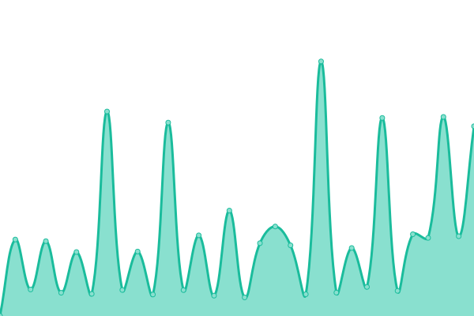 841ms
     
 | 

<a href="https://uptime.cloudbip.com/history/dewaweb-com">100.00%</a>
    

|  [dijaminmurah.com](https://dijaminmurah.com) | 🟩 Up | [dijaminmurah-com.yml](https://github.com/cloudbip/upptime/commits/HEAD/history/dijaminmurah-com.yml) | 

 5161ms
     
 | 

<a href="https://uptime.cloudbip.com/history/dijaminmurah-com">100.00%</a>
    

|  [domainesia.com](https://domainesia.com) | 🟩 Up | [domainesia-com.yml](https://github.com/cloudbip/upptime/commits/HEAD/history/domainesia-com.yml) | 

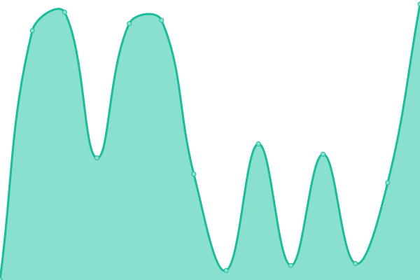 726ms
     
 | 

<a href="https://uptime.cloudbip.com/history/domainesia-com">100.00%</a>
    

|  [hostingan.id](https://hostingan.id) | 🟩 Up | [hostingan-id.yml](https://github.com/cloudbip/upptime/commits/HEAD/history/hostingan-id.yml) | 

 3556ms
     
 | 

<a href="https://uptime.cloudbip.com/history/hostingan-id">37.10%</a>
    

|  [my.domainesia.com](https://my.domainesia.com) | 🟩 Up | [my-domainesia-com.yml](https://github.com/cloudbip/upptime/commits/HEAD/history/my-domainesia-com.yml) | 

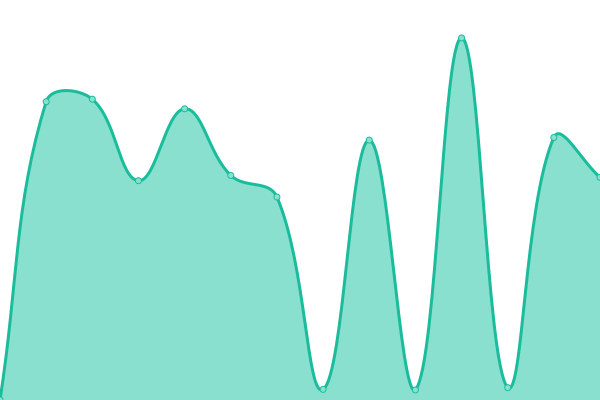 2079ms
     
 | 

<a href="https://uptime.cloudbip.com/history/my-domainesia-com">100.00%</a>
    

|  [exabytes.co.id](https://exabytes.co.id) | 🟩 Up | [exabytes-co-id.yml](https://github.com/cloudbip/upptime/commits/HEAD/history/exabytes-co-id.yml) | 

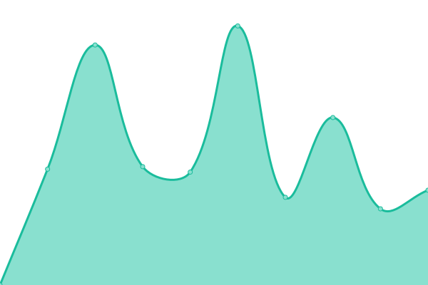 7326ms
     
 | 

<a href="https://uptime.cloudbip.com/history/exabytes-co-id">100.00%</a>
    

|  [go.exabytes.co.id](https://go.exabytes.co.id) | 🟩 Up | [go-exabytes-co-id.yml](https://github.com/cloudbip/upptime/commits/HEAD/history/go-exabytes-co-id.yml) | 

 3451ms
     
 | 

<a href="https://uptime.cloudbip.com/history/go-exabytes-co-id">100.00%</a>
    

|  [herza.id](https://herza.id) | 🟩 Up | [herza-id.yml](https://github.com/cloudbip/upptime/commits/HEAD/history/herza-id.yml) | 

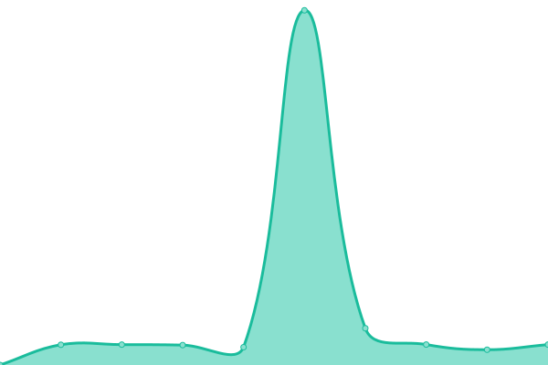 1458ms
     
 | 

<a href="https://uptime.cloudbip.com/history/herza-id">100.00%</a>
    

|  [hoster.co.id](https://hoster.co.id) | 🟩 Up | [hoster-co-id.yml](https://github.com/cloudbip/upptime/commits/HEAD/history/hoster-co-id.yml) | 

 2791ms
     
 | 

<a href="https://uptime.cloudbip.com/history/hoster-co-id">100.00%</a>
    

|  [hostinger.co.id](https://hostinger.co.id) | 🟩 Up | [hostinger-co-id.yml](https://github.com/cloudbip/upptime/commits/HEAD/history/hostinger-co-id.yml) | 

 478ms
     
 | 

<a href="https://uptime.cloudbip.com/history/hostinger-co-id">99.80%</a>
    

|  [hostingpas.com](https://hostingpas.com) | 🟩 Up | [hostingpas-com.yml](https://github.com/cloudbip/upptime/commits/HEAD/history/hostingpas-com.yml) | 

 760ms
     
 | 

<a href="https://uptime.cloudbip.com/history/hostingpas-com">100.00%</a>
    

|  [id.hosting24.com](https://id.hosting24.com) | 🟩 Up | [id-hosting24-com.yml](https://github.com/cloudbip/upptime/commits/HEAD/history/id-hosting24-com.yml) | 

 441ms
     
 | 

<a href="https://uptime.cloudbip.com/history/id-hosting24-com">100.00%</a>
    

|  [idwebhost.com](https://idwebhost.com) | 🟩 Up | [idwebhost-com.yml](https://github.com/cloudbip/upptime/commits/HEAD/history/idwebhost-com.yml) | 

 1573ms
     
 | 

<a href="https://uptime.cloudbip.com/history/idwebhost-com">100.00%</a>
    

|  [member.idwebhost.com](https://member.idwebhost.com) | 🟩 Up | [member-idwebhost-com.yml](https://github.com/cloudbip/upptime/commits/HEAD/history/member-idwebhost-com.yml) | 

 1655ms
     
 | 

<a href="https://uptime.cloudbip.com/history/member-idwebhost-com">100.00%</a>
    

|  [indosite.com](https://indosite.com) | 🟩 Up | [indosite-com.yml](https://github.com/cloudbip/upptime/commits/HEAD/history/indosite-com.yml) | 

 2864ms
     
 | 

<a href="https://uptime.cloudbip.com/history/indosite-com">100.00%</a>
    

|  [Jagoanhosting.com](https://www.jagoanhosting.com) | 🟩 Up | [jagoanhosting-com.yml](https://github.com/cloudbip/upptime/commits/HEAD/history/jagoanhosting-com.yml) | 

 312ms
     
 | 

<a href="https://uptime.cloudbip.com/history/jagoanhosting-com">100.00%</a>
    

|  [member.jagoanhosting.com](https://member.jagoanhosting.com) | 🟩 Up | [member-jagoanhosting-com.yml](https://github.com/cloudbip/upptime/commits/HEAD/history/member-jagoanhosting-com.yml) | 

 3001ms
     
 | 

<a href="https://uptime.cloudbip.com/history/member-jagoanhosting-com">100.00%</a>
    

|  [jakartawebhosting.com](https://jakartawebhosting.com) | 🟩 Up | [jakartawebhosting-com.yml](https://github.com/cloudbip/upptime/commits/HEAD/history/jakartawebhosting-com.yml) | 

 1569ms
     
 | 

<a href="https://uptime.cloudbip.com/history/jakartawebhosting-com">100.00%</a>
    

|  [jetorbit.com](https://jetorbit.com) | 🟩 Up | [jetorbit-com.yml](https://github.com/cloudbip/upptime/commits/HEAD/history/jetorbit-com.yml) | 

 1790ms
     
 | 

<a href="https://uptime.cloudbip.com/history/jetorbit-com">99.64%</a>
    

|  [jogjahost.co.id](https://jogjahost.co.id) | 🟩 Up | [jogjahost-co-id.yml](https://github.com/cloudbip/upptime/commits/HEAD/history/jogjahost-co-id.yml) | 

 2101ms
     
 | 

<a href="https://uptime.cloudbip.com/history/jogjahost-co-id">100.00%</a>
    

|  [masterweb.com](https://masterweb.com) | 🟩 Up | [masterweb-com.yml](https://github.com/cloudbip/upptime/commits/HEAD/history/masterweb-com.yml) | 

 2770ms
     
 | 

<a href="https://uptime.cloudbip.com/history/masterweb-com">100.00%</a>
    

|  [masterkey.masterweb.com](https://masterkey.masterweb.com) | 🟩 Up | [masterkey-masterweb-com.yml](https://github.com/cloudbip/upptime/commits/HEAD/history/masterkey-masterweb-com.yml) | 

 1193ms
     
 | 

<a href="https://uptime.cloudbip.com/history/masterkey-masterweb-com">100.00%</a>
    

|  [niagahoster.co.id](https://niagahoster.co.id) | 🟩 Up | [niagahoster-co-id.yml](https://github.com/cloudbip/upptime/commits/HEAD/history/niagahoster-co-id.yml) | 

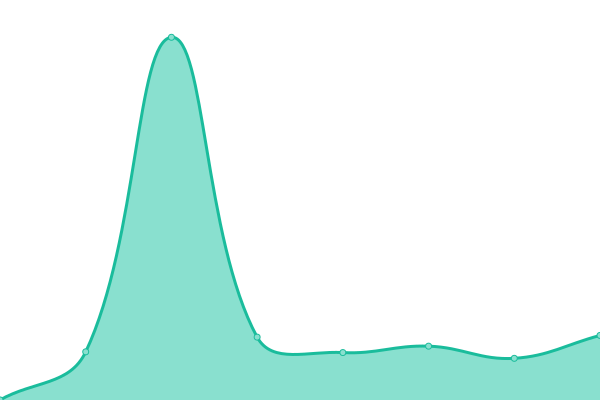 2625ms
     
 | 

<a href="https://uptime.cloudbip.com/history/niagahoster-co-id">100.00%</a>
    

|  [portal.neo.id](https://portal.neo.id) | 🟩 Up | [portal-neo-id.yml](https://github.com/cloudbip/upptime/commits/HEAD/history/portal-neo-id.yml) | 

 1134ms
     
 | 

<a href="https://uptime.cloudbip.com/history/portal-neo-id">100.00%</a>
    

|  [web.neo.id](https://web.neo.id) | 🟩 Up | [web-neo-id.yml](https://github.com/cloudbip/upptime/commits/HEAD/history/web-neo-id.yml) | 

 1993ms
     
 | 

<a href="https://uptime.cloudbip.com/history/web-neo-id">100.00%</a>
    

|  [qwords.com](https://qwords.com) | 🟩 Up | [qwords-com.yml](https://github.com/cloudbip/upptime/commits/HEAD/history/qwords-com.yml) | 

 2620ms
     
 | 

<a href="https://uptime.cloudbip.com/history/qwords-com">100.00%</a>
    

|  [portal.qwords.com](https://portal.qwords.com) | 🟩 Up | [portal-qwords-com.yml](https://github.com/cloudbip/upptime/commits/HEAD/history/portal-qwords-com.yml) | 

 3679ms
     
 | 

<a href="https://uptime.cloudbip.com/history/portal-qwords-com">100.00%</a>
    

|  [puskomedia.id](https://puskomedia.id) | 🟩 Up | [puskomedia-id.yml](https://github.com/cloudbip/upptime/commits/HEAD/history/puskomedia-id.yml) | 

 7858ms
     
 | 

<a href="https://uptime.cloudbip.com/history/puskomedia-id">100.00%</a>
    

|  [rackrock.co.id](https://rackrock.co.id) | 🟩 Up | [rackrock-co-id.yml](https://github.com/cloudbip/upptime/commits/HEAD/history/rackrock-co-id.yml) | 

 1259ms
     
 | 

<a href="https://uptime.cloudbip.com/history/rackrock-co-id">100.00%</a>
    

|  [sketsaweb.com](https://sketsaweb.com) | 🟩 Up | [sketsaweb-com.yml](https://github.com/cloudbip/upptime/commits/HEAD/history/sketsaweb-com.yml) | 

 1691ms
     
 | 

<a href="https://uptime.cloudbip.com/history/sketsaweb-com">100.00%</a>
    

|  [idnix.net](https://idnix.net) | 🟩 Up | [idnix-net.yml](https://github.com/cloudbip/upptime/commits/HEAD/history/idnix-net.yml) | 

 1886ms
     
 | 

<a href="https://uptime.cloudbip.com/history/idnix-net">100.00%</a>
    

|  [connectindo.com](https://connectindo.com) | 🟩 Up | [connectindo-com.yml](https://github.com/cloudbip/upptime/commits/HEAD/history/connectindo-com.yml) | 

 3074ms
     
 | 

<a href="https://uptime.cloudbip.com/history/connectindo-com">91.80%</a>
    

|  [flazznetworks.com](https://flazznetworks.com) | 🟩 Up | [flazznetworks-com.yml](https://github.com/cloudbip/upptime/commits/HEAD/history/flazznetworks-com.yml) | 

 2259ms
     
 | 

<a href="https://uptime.cloudbip.com/history/flazznetworks-com">100.00%</a>
    

|  [sintegrasi](https://sintegrasi.com) | 🟩 Up | [sintegrasi.yml](https://github.com/cloudbip/upptime/commits/HEAD/history/sintegrasi.yml) | 

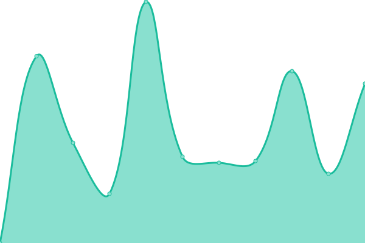 8103ms
     
 | 

<a href="https://uptime.cloudbip.com/history/sintegrasi">100.00%</a>
    

|  [telkomsigma.co.id](https://www.telkomsigma.co.id) | 🟩 Up | [telkomsigma-co-id.yml](https://github.com/cloudbip/upptime/commits/HEAD/history/telkomsigma-co-id.yml) | 

 2087ms
     
 | 

<a href="https://uptime.cloudbip.com/history/telkomsigma-co-id">100.00%</a>
    

|  [kencengsolusindo.co.id](https://kencengsolusindo.co.id) | 🟩 Up | [kencengsolusindo-co-id.yml](https://github.com/cloudbip/upptime/commits/HEAD/history/kencengsolusindo-co-id.yml) | 

 3246ms
     
 | 

<a href="https://uptime.cloudbip.com/history/kencengsolusindo-co-id">100.00%</a>
    

|  [webiihost.com](https://webiihost.com) | 🟩 Up | [webiihost-com.yml](https://github.com/cloudbip/upptime/commits/HEAD/history/webiihost-com.yml) | 

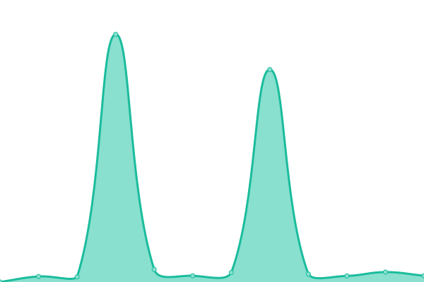 737ms
     
 | 

<a href="https://uptime.cloudbip.com/history/webiihost-com">100.00%</a>
    

|  [dobelhost.com](https://dobelhost.com) | 🟩 Up | [dobelhost-com.yml](https://github.com/cloudbip/upptime/commits/HEAD/history/dobelhost-com.yml) | 

 2117ms
     
 | 

<a href="https://uptime.cloudbip.com/history/dobelhost-com">100.00%</a>
    

|  [biggo.id](https://biggo.id) | 🟩 Up | [biggo-id.yml](https://github.com/cloudbip/upptime/commits/HEAD/history/biggo-id.yml) | 

 1203ms
     
 | 

<a href="https://uptime.cloudbip.com/history/biggo-id">99.55%</a>
    

|  [nusa.id](https://nusa.id) | 🟩 Up | [nusa-id.yml](https://github.com/cloudbip/upptime/commits/HEAD/history/nusa-id.yml) | 

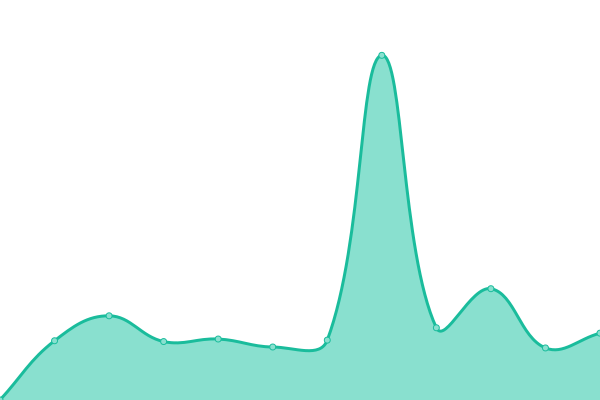 2350ms
     
 | 

<a href="https://uptime.cloudbip.com/history/nusa-id">100.00%</a>
    

|  [sarang.id](https://sarang.id) | 🟩 Up | [sarang-id.yml](https://github.com/cloudbip/upptime/commits/HEAD/history/sarang-id.yml) | 

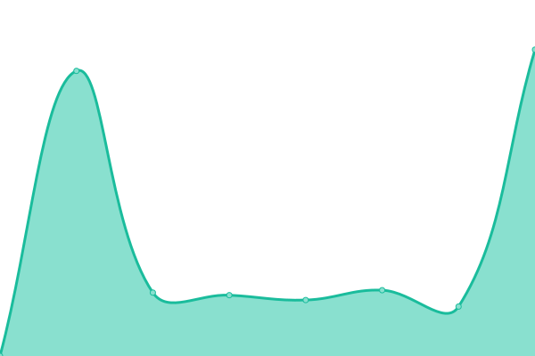 1486ms
     
 | 

<a href="https://uptime.cloudbip.com/history/sarang-id">100.00%</a>
    

|  [palapacloud.id](https://palapacloud.id) | 🟥 Down | [palapacloud-id.yml](https://github.com/cloudbip/upptime/commits/HEAD/history/palapacloud-id.yml) | 

 0ms
     
 | 

<a href="https://uptime.cloudbip.com/history/palapacloud-id">0.00%</a>
    

|  [biznetnetworks.com](https://biznetnetworks.com) | 🟩 Up | [biznetnetworks-com.yml](https://github.com/cloudbip/upptime/commits/HEAD/history/biznetnetworks-com.yml) | 

 3136ms
     
 | 

<a href="https://uptime.cloudbip.com/history/biznetnetworks-com">100.00%</a>
    

|  [kuoota.com](https://kuoota.com) | 🟥 Down | [kuoota-com.yml](https://github.com/cloudbip/upptime/commits/HEAD/history/kuoota-com.yml) | 

 0ms
     
 | 

<a href="https://uptime.cloudbip.com/history/kuoota-com">0.00%</a>
    

|  [wix.com](https://wix.com) | 🟩 Up | [wix-com.yml](https://github.com/cloudbip/upptime/commits/HEAD/history/wix-com.yml) | 

 773ms
     
 | 

<a href="https://uptime.cloudbip.com/history/wix-com">99.79%</a>
    

|  [bluehost.com](https://bluehost.com) | 🟥 Down | [bluehost-com.yml](https://github.com/cloudbip/upptime/commits/HEAD/history/bluehost-com.yml) | 

 87ms
     
 | 

<a href="https://uptime.cloudbip.com/history/bluehost-com">0.00%</a>
    

|  [shopify.com](https://shopify.com) | 🟩 Up | [shopify-com.yml](https://github.com/cloudbip/upptime/commits/HEAD/history/shopify-com.yml) | 

 396ms
     
 | 

<a href="https://uptime.cloudbip.com/history/shopify-com">100.00%</a>
    

|  [webflow.com](https://webflow.com) | 🟩 Up | [webflow-com.yml](https://github.com/cloudbip/upptime/commits/HEAD/history/webflow-com.yml) | 

 367ms
     
 | 

<a href="https://uptime.cloudbip.com/history/webflow-com">0.00%</a>
    

|  [squarespace.com](https://www.squarespace.com) | 🟩 Up | [squarespace-com.yml](https://github.com/cloudbip/upptime/commits/HEAD/history/squarespace-com.yml) | 

 335ms
     
 | 

<a href="https://uptime.cloudbip.com/history/squarespace-com">100.00%</a>
    

|  [carrd.co](https://carrd.co) | 🟩 Up | [carrd-co.yml](https://github.com/cloudbip/upptime/commits/HEAD/history/carrd-co.yml) | 

 222ms
     
 | 

<a href="https://uptime.cloudbip.com/history/carrd-co">100.00%</a>
    

|  [weebly.com](https://www.weebly.com) | 🟩 Up | [weebly-com.yml](https://github.com/cloudbip/upptime/commits/HEAD/history/weebly-com.yml) | 

 497ms
     
 | 

<a href="https://uptime.cloudbip.com/history/weebly-com">100.00%</a>
    

|  [zyro.com](https://zyro.com) | 🟩 Up | [zyro-com.yml](https://github.com/cloudbip/upptime/commits/HEAD/history/zyro-com.yml) | 

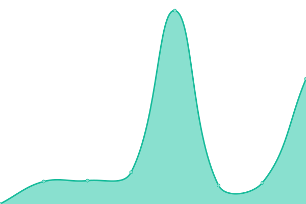 547ms
     
 | 

<a href="https://uptime.cloudbip.com/history/zyro-com">100.00%</a>
    

|  [bigcommerce.com](https://www.bigcommerce.com) | 🟩 Up | [bigcommerce-com.yml](https://github.com/cloudbip/upptime/commits/HEAD/history/bigcommerce-com.yml) | 

 171ms
     
 | 

<a href="https://uptime.cloudbip.com/history/bigcommerce-com">100.00%</a>
    

|  [wordpress.com](https://wordpress.com) | 🟩 Up | [wordpress-com.yml](https://github.com/cloudbip/upptime/commits/HEAD/history/wordpress-com.yml) | 

 91ms
     
 | 

<a href="https://uptime.cloudbip.com/history/wordpress-com">100.00%</a>
    

|  [duda.co](https://duda.co) | 🟩 Up | [duda-co.yml](https://github.com/cloudbip/upptime/commits/HEAD/history/duda-co.yml) | 

 260ms
     
 | 

<a href="https://uptime.cloudbip.com/history/duda-co">100.00%</a>
    

|  [digitalocean.com](https://digitalocean.com) | 🟩 Up | [digitalocean-com.yml](https://github.com/cloudbip/upptime/commits/HEAD/history/digitalocean-com.yml) | 

 238ms
     
 | 

<a href="https://uptime.cloudbip.com/history/digitalocean-com">100.00%</a>
    

|  [upcloud.com](https://upcloud.com) | 🟩 Up | [upcloud-com.yml](https://github.com/cloudbip/upptime/commits/HEAD/history/upcloud-com.yml) | 

 345ms
     
 | 

<a href="https://uptime.cloudbip.com/history/upcloud-com">100.00%</a>
    

|  [vultr.com](https://vultr.com) | 🟥 Down | [vultr-com.yml](https://github.com/cloudbip/upptime/commits/HEAD/history/vultr-com.yml) | 

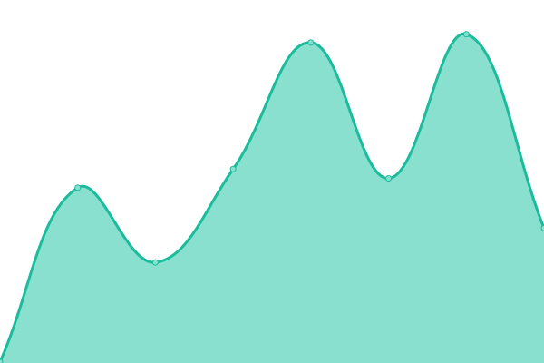 329ms
     
 | 

<a href="https://uptime.cloudbip.com/history/vultr-com">0.00%</a>
    

|  [ovh.com](https://ovh.com) | 🟩 Up | [ovh-com.yml](https://github.com/cloudbip/upptime/commits/HEAD/history/ovh-com.yml) | 

 1163ms
     
 | 

<a href="https://uptime.cloudbip.com/history/ovh-com">0.00%</a>
    

|  [google.com](https://google.com) | 🟩 Up | [google-com.yml](https://github.com/cloudbip/upptime/commits/HEAD/history/google-com.yml) | 

 279ms
     
 | 

<a href="https://uptime.cloudbip.com/history/google-com">100.00%</a>
    

|  [cloudflare.com](https://cloudflare.com) | 🟩 Up | [cloudflare-com.yml](https://github.com/cloudbip/upptime/commits/HEAD/history/cloudflare-com.yml) | 

 217ms
     
 | 

<a href="https://uptime.cloudbip.com/history/cloudflare-com">100.00%</a>
    

|  [detik.com](https://detik.com) | 🟩 Up | [detik-com.yml](https://github.com/cloudbip/upptime/commits/HEAD/history/detik-com.yml) | 

 3893ms
     
 | 

<a href="https://uptime.cloudbip.com/history/detik-com">100.00%</a>
    

|  [kompas.com](https://kompas.com) | 🟩 Up | [kompas-com.yml](https://github.com/cloudbip/upptime/commits/HEAD/history/kompas-com.yml) | 

 1526ms
     
 | 

<a href="https://uptime.cloudbip.com/history/kompas-com">100.00%</a>
    

|  [lintas.net.id](https://lintas.net.id) | 🟥 Down | [lintas-net-id.yml](https://github.com/cloudbip/upptime/commits/HEAD/history/lintas-net-id.yml) | 

 0ms
     
 | 

<a href="https://uptime.cloudbip.com/history/lintas-net-id">0.00%</a>
    

|  [cbn.id](https://cbn.id) | 🟩 Up | [cbn-id.yml](https://github.com/cloudbip/upptime/commits/HEAD/history/cbn-id.yml) | 

 1692ms
     
 | 

<a href="https://uptime.cloudbip.com/history/cbn-id">65.69%</a>
    

|  [hsp.net.id](https://hsp.net.id) | 🟩 Up | [hsp-net-id.yml](https://github.com/cloudbip/upptime/commits/HEAD/history/hsp-net-id.yml) | 

 1240ms
     
 | 

<a href="https://uptime.cloudbip.com/history/hsp-net-id">99.20%</a>
    

|  [pgascom.co.id](https://www.pgascom.co.id/) | 🟩 Up | [pgascom-co-id.yml](https://github.com/cloudbip/upptime/commits/HEAD/history/pgascom-co-id.yml) | 

 2619ms
     
 | 

<a href="https://uptime.cloudbip.com/history/pgascom-co-id">99.76%</a>
    

|  [rad.net.id](http://rad.net.id) | 🟩 Up | [rad-net-id.yml](https://github.com/cloudbip/upptime/commits/HEAD/history/rad-net-id.yml) | 

 3340ms
     
 | 

<a href="https://uptime.cloudbip.com/history/rad-net-id">100.00%</a>
    

|  [indonet.co.id](https://indonet.id) | 🟩 Up | [indonet-co-id.yml](https://github.com/cloudbip/upptime/commits/HEAD/history/indonet-co-id.yml) | 

 3577ms
     
 | 

<a href="https://uptime.cloudbip.com/history/indonet-co-id">100.00%</a>
    

|  [indosatm2.com](http://indosatm2.com/) | 🟥 Down | [indosatm2-com.yml](https://github.com/cloudbip/upptime/commits/HEAD/history/indosatm2-com.yml) | 

 0ms
     
 | 

<a href="https://uptime.cloudbip.com/history/indosatm2-com">0.00%</a>
    

|  [melsa.id](https://melsa.id) | 🟩 Up | [melsa-id.yml](https://github.com/cloudbip/upptime/commits/HEAD/history/melsa-id.yml) | 

 6577ms
     
 | 

<a href="https://uptime.cloudbip.com/history/melsa-id">100.00%</a>
    

|  [myrepublic.co.id](https://myrepublic.co.id) | 🟩 Up | [myrepublic-co-id.yml](https://github.com/cloudbip/upptime/commits/HEAD/history/myrepublic-co-id.yml) | 

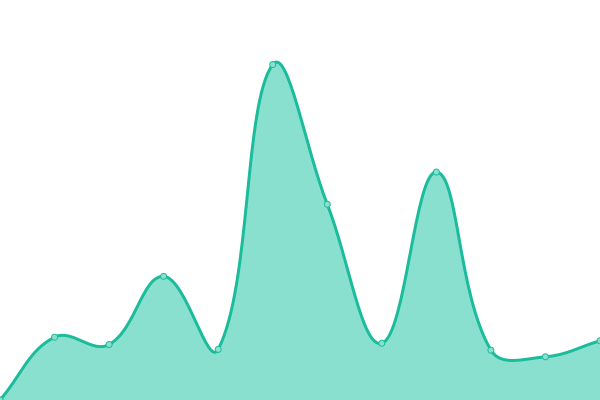 1369ms
     
 | 

<a href="https://uptime.cloudbip.com/history/myrepublic-co-id">99.31%</a>
    

|  [mncplay.id](https://mncplay.id) | 🟩 Up | [mncplay-id.yml](https://github.com/cloudbip/upptime/commits/HEAD/history/mncplay-id.yml) | 

 4825ms
     
 | 

<a href="https://uptime.cloudbip.com/history/mncplay-id">100.00%</a>
    

|  [telkom.co.id](https://www.telkom.co.id/sites) | 🟩 Up | [telkom-co-id.yml](https://github.com/cloudbip/upptime/commits/HEAD/history/telkom-co-id.yml) | 

 2718ms
     
 | 

<a href="https://uptime.cloudbip.com/history/telkom-co-id">100.00%</a>
    

|  [telkomsel.com](https://www.telkomsel.com) | 🟩 Up | [telkomsel-com.yml](https://github.com/cloudbip/upptime/commits/HEAD/history/telkomsel-com.yml) | 

 3728ms
     
 | 

<a href="https://uptime.cloudbip.com/history/telkomsel-com">100.00%</a>
    

|  [indosatooredoo.comm](https://indosatooredoo.com) | 🟩 Up | [indosatooredoo-comm.yml](https://github.com/cloudbip/upptime/commits/HEAD/history/indosatooredoo-comm.yml) | 

 2131ms
     
 | 

<a href="https://uptime.cloudbip.com/history/indosatooredoo-comm">99.07%</a>
    

|  [xl.co.id](https://xl.co.id) | 🟥 Down | [xl-co-id.yml](https://github.com/cloudbip/upptime/commits/HEAD/history/xl-co-id.yml) | 

 0ms
     
 | 

<a href="https://uptime.cloudbip.com/history/xl-co-id">0.00%</a>
    

|  [berdu.id](https://berdu.id) | 🟩 Up | [berdu-id.yml](https://github.com/cloudbip/upptime/commits/HEAD/history/berdu-id.yml) | 

 1607ms
     
 | 

<a href="https://uptime.cloudbip.com/history/berdu-id">100.00%</a>
    

|  [mokapos.com](https://mokapos.com) | 🟩 Up | [mokapos-com.yml](https://github.com/cloudbip/upptime/commits/HEAD/history/mokapos-com.yml) | 

 2372ms
     
 | 

<a href="https://uptime.cloudbip.com/history/mokapos-com">100.00%</a>
    

|  [daeliweb.com](https://daeliweb.com) | 🟥 Down | [daeliweb-com.yml](https://github.com/cloudbip/upptime/commits/HEAD/history/daeliweb-com.yml) | 

 0ms
     
 | 

<a href="https://uptime.cloudbip.com/history/daeliweb-com">0.00%</a>
    

|  [melejit.id](https://melejit.id) | 🟩 Up | [melejit-id.yml](https://github.com/cloudbip/upptime/commits/HEAD/history/melejit-id.yml) | 

 266ms
     
 | 

<a href="https://uptime.cloudbip.com/history/melejit-id">100.00%</a>
    

|  [sitemaya.com](https://sitemaya.com) | 🟩 Up | [sitemaya-com.yml](https://github.com/cloudbip/upptime/commits/HEAD/history/sitemaya-com.yml) | 

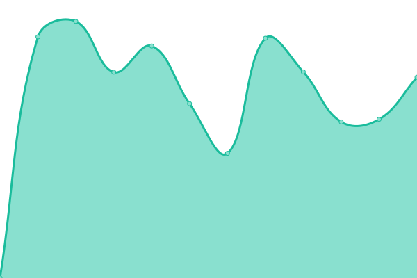 1431ms
     
 | 

<a href="https://uptime.cloudbip.com/history/sitemaya-com">100.00%</a>
    

<!--end: status pages-->

[**Visit our status website →**](https://uptime.cloudbip.com)

## 📄 License

- Powered by: [Upptime](https://github.com/upptime/upptime)
- Code: [MIT](./LICENSE) © [Upptime](https://upptime.js.org)
- Data in the `./history` directory: [Open Database License](https://opendatacommons.org/licenses/odbl/1-0/)
